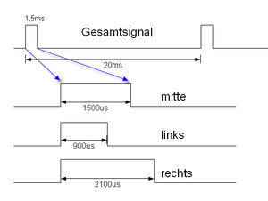

## Servo (Aktor) 

[http://wiki.rc-network.de/Servo](http://wiki.rc-network.de/Servo)

- - -

Der Servo (auch Rudermaschine) hat die Aufgabe, entsprechend dem Signal, dass er vom Empfänger erhält, die Ruder (oder andere Komponenten am Modell) zu stellen.

Servo lassen sich, in der Regel, von 0 - 180° bewegen. Der entsprechende Stellwinkel wird mittels eines Wert von 0.0 bis 1.0 angegeben.

Es gibt analoge und digitale Servo&#039;s. Der Unterschied liegt darin, dass digitale Servo erst anfangen den Stellwinkel zu wechseln, wenn ein sauberes Signal anliegt.

Servo haben einen Stellmoment bzw. die Stellkraft, z.B. 9 Gramm, welche nicht überschritten werden sollte.

Servo benötigt die [Servo Library](http://developer.mbed.org/users/simon/code/Servo/). Diese Steuert einen Servo mittels PWM Signal an.

Servo müssen in der mbed Plattform einmalig kalibriert werden, ansonsten wird nicht der volle 180° Winkel benützt. Ein gutes Programm dazu ist [ServoProgram](https://developer.mbed.org/users/simon/code/ServoProgram/) von Simon Ford.

Weitere Informationen und eine Ausführliche Einführung in Englisch [An Introduction to RC Servos](http://developer.mbed.org/users/4180_1/notebook/an-introduction-to-servos/)

### Anwendungen 

*   Steuerung von Roboterarmen
*   Modellflugzeuge
*   Schalten von Weichen auf der Modelleisenbahn

### Anschlussbelegung (Servo - Shield) 

Der Servo wird mit 5V betrieben und kann direkt auf einen der G/V/S Header gesteckt werden. Zusätzlich existiert ein mit Servo1 und Servo2 bezeichnetes Steckerpaar. Das orange Kabel des Servo kommt auf S (Signal) bzw. zeigt nach links.

### Programm

* [mbed Compiler](https://developer.mbed.org/compiler/#import:/teams/smdiotkit1ch/code/Servo/)

