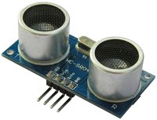

## [Ultraschall Abstandsmesser](http://de.wikipedia.org/wiki/Entfernungsmessung) 

Timing

- - -

HC-SR04 

- - - 

Unter Entfernungsmessung, Abstandsmessung oder Längenmessung versteht man die Messung des Abstandes zweier Punkte im Raum durch direkten oder indirekten Vergleich mit einer Längenmasseinheit wie beispielsweise dem Meter.

Ein Ultraschall Abstandsmesser misst die Entfernung zu einem Objekt (z.B. Wand) in cm.

Der Erkennungszyklus wird mittels eines Impulses von min. 10 Mikrosekunden auf der "pulse trigger" Leitung (Trig) gestartet. Sobald diese Leitung wieder tief wird, sendet der Sensor eine Serie von acht Schaltimpulsen, wartet einen kurzen Moment und setzt dann die Leitung Echo hoch. Das erste Ultraschallecho welches Empfangen wird, setzt die Echo Leitung wieder tief. Durch die Zeitspanne dazwischen, lässt sich den Abstand zu einem Objekt bestimmen.

Die Ganze Arbeit nimmt uns die [SR04](http://developer.mbed.org/users/ejteb/code/HC_SR04_Ultrasonic_Library/) Library ab.

### Anwendungen 

*   Erkennen von Hindernissen bei Robotern

### Anschlussbelegung (Sensor - Shield)

*   VCC - V (5 Volt)
*   Trig - D5
*   Echo - D6
*   GND - G (Ground)