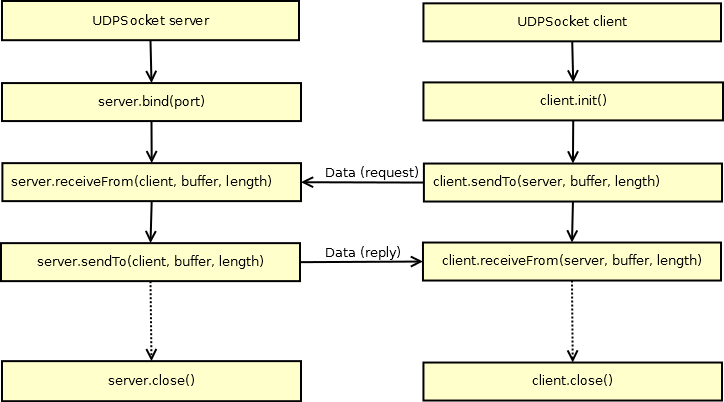

##  UDP (Datagram) Socket Client / Server

 

Ablauf UDP Kommunikation

- - - 

UDP (Datagram) Sockets erlauben auch eine Kommunikation zwischen mbed Board&#039;s

### Ablauf der Socket Kommunikation

#### Serverseitig: 

*   Socket erstellen
*   Socket binden
*   warten auf Pakete

#### Clientseitig:

*   Socket erstellen
*   An Adresse senden

### Programm

* [mbed Compiler](https://developer.mbed.org/compiler/#import:/users/mbed_official/code/UDPEchoServer/)
* [mbed Compiler](https://developer.mbed.org/compiler/#import:/users/mbed_official/code/UDPEchoClient/)

