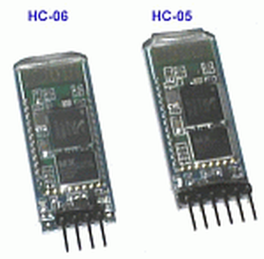
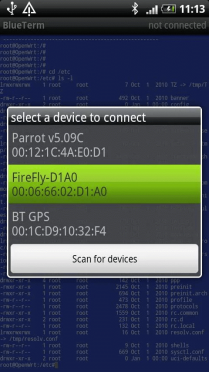

## Bluetooth Modem (UART)



JY-MCU Bluetooth Module

- - -

 

[Android APP Blue Term](https://play.google.com/store/apps/details?id=es.pymasde.blueterm&hl=de) 

- - - 

[Bluetooth](http://de.wikipedia.org/wiki/Bluetooth) ist ein in den 1990er-Jahren durch die Bluetooth Special Interest Group (SIG) entwickelter Industriestandard gemäß IEEE 802.15.1 für die Datenübertragung zwischen Geräten über kurze Distanz per Funktechnik (WPAN).

Bluetooth eignet sich hervorragend um drahtlos mit einem mbed Board zu kommunizieren. Preiswerte Bluetooth-Module gibt es z.B. unter der Bezeichnung JY-MCU.

Das Modul mit dem Chip HC-06 kann nur als Slave arbeiten. Das heisst es kann nicht aktiv Kontakt mit einem anderen Bluetooth-Gerät aufnehmen. Es wartet bis es kontaktiert wird. Die Alternative ist das Modul mit dem HC-05 Chip welches auch als Master konfiguriert werden kann.

Zum Testen eignet sich die Android APP [Blue Term.](https://play.google.com/store/apps/details?id=es.pymasde.blueterm&hl=de)

Das Bluetooth Modul kann u.a. wie folgt angeschlossen werden:

*   Einstecken auf dem FRDM-K64F vorgesehenen Bluetooth Stecker.
*   Verbinden der Stecker (oben) mit dem Serial Stecker (obere zwei Pin&#039;s). Das Modem ist mit den Pin D0 und D1 (USBTX, USBRX))) verbunden.

Anschliessend ist die Android APP Blue Term zu installieren, die APP zu starten und mit dem HC-06 Modul zu verbinden. Der Pin Code ist 1234\. Durch drücken einer der Tasten qwert erscheint eine Meldung in der Blue Term APP.

Weitere Informationen zu den Modem Befehlen sind im [Bluetooth-Kochbuch](http://arduino-hannover.de/2013/07/20/bluetooth-kochbuch-fur-arduino/) zu finden.

### Bluetooth Modem Konfiguration (UART)

Wird das Bluetooth Modem mit niedergedrückten Button an den Strom angeschlossen, schaltet es in den Konfigurationsmodus, damit Blink die LED langsamer als sonst.

Im Konfigurationsmodus können die Einstellungen des Modem mittels AT Befehlen geändert werden, z.B. Name, Master/Slave Modus etc.

Zum Konfigurieren eignet sich am Besten der PL2303HX Converter USB To RS232 TTL der wie folgt mit dem Modem zu verbinden ist:

*   Rotes Kabel - VCC (5 Volt)
*   Schwarzes Kabel - GND (Ground)
*   Weises Kabel - mit TXD (Transmit) verbinden
*   Grünes Kabel - mit RXD (Receive) verbinden

Anschliessend ein beliebiges Terminalprogramm starten mit folgenden Einstellungen:

*   Baud: 38600
*   Local Echo
*   Transmit: CR/LF

Dann sind folgende AT Befehle verfügbar:

*   **AT** - Antwort OK (zu Testzwecken)
*   **AT+ROLE?** - Role Abfragen. 0 = Slave, 1 = Master. Setzen z.B. mittels **AT+ROLE=1**
*   **AT+CMODE?** - Verbindungsmodus abfragen. 0 = mit allen Geräten verbinden, 1 = nur spezifische.
*   **AT+ADDR?** - Adresse (ähnlich einer MAC-Adresse) abfragen.
*   **AT+BIND=...** - Verbinden mit spezifischen Modem mit Adresse ...
*   **AT+INQ** - Auflisten der Vorhandenen Verbindungsbereiten Bluetooth Modems.
*   **AT+INIT** - Modemmodus starten, dass Modem schaltet auf 9600 Baud um und ist Bereit bzw. versucht als Master eine Verbindung zu einem Slave aufzubauen. Als Slave blink die LED wieder schnell als Master bzw. bei bestehender Verbindung blinkt die LED jeweils kurz zweimal auf.
*   **AT+NAME=...** - Setzen des Verbindungsnamen.
*   **AT+PIN=...** - Setzen des Pins.

Eine Verbindung als Master zu einem Slave aufbauen:

```cpp
AT
[OK]
AT+ROLE=1
[OK]
AT+INIT                        
                        ```