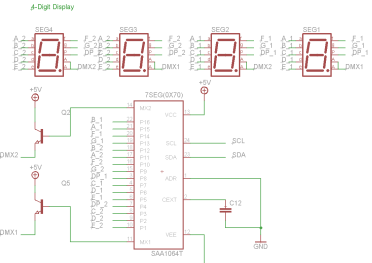

## 4 Digit Display (auf SMD Shield)

Schaltplan

- - -

Das Digit Display ist eine 4-stellige 7-Segment Anzeige.

Die Ansteuerung erfolgt mittels der [SAA1064 Library](http://developer.mbed.org/teams/smdiotkitch/code/SAA1064/).

### Anwendungen 

*   Anzeige von Messwerten, Zeit etc.

### Programm

* [mbed Compiler](http://developer.mbed.org/teams/smdiotkitch/code/4DigitLED/) 

